<div align="center">



<br/><br/>

<a href="https://arcflow-coral.vercel.app"></a>&nbsp;
<a href="https://www.linkedin.com/in/pierre-emmanuel"></a>&nbsp;
<a href="mailto:pierre@afryx.com"></a>&nbsp;
<a href="https://huggingface.co/theyoungceo"></a>


</div>

<br/>

## <samp>$ whoami</samp>

<samp>Founder & CTO at <a href="https://github.com/Kampus-africa">Afryx</a> — I design, build and ship AI-native products end-to-end: multi-tenant backends, agent orchestration graphs, and cross-platform clients that real users depend on. Currently reading Applied AI at the University of Bradford while running an 8-person team across two continents.</samp>

<br/>

<samp>Three products in flight:</samp>

<table>
<tr>
<td width="33%" valign="top">
<samp><b>KAMPUS</b></samp><br/><br/>
<samp>The operating system for African schools. Multi-tenant · web, mobile & desktop · APDP-compliant. Pilot schools onboarding now.</samp>
</td>
<td width="33%" valign="top">
<samp><b>ARCFLOW</b></samp><br/><br/>
<samp>AI Chief of Staff for UK SMBs. 12-node LangGraph pipeline in production — turns commitments into tracked, accountable actions.</samp>
</td>
<td width="33%" valign="top">
<samp><b>MIYORA AI</b></samp><br/><br/>
<samp>ML-applied skin intelligence. Computer vision meets consumer health.</samp>
</td>
</tr>
</table>

## <samp>$ languages --mastery</samp>



## <samp>$ stack --list</samp>

<div align="center">

<samp>ai / agents</samp>
<br/><br/>
&nbsp;&nbsp;

<br/>

<samp>product</samp>
<br/><br/>


<br/><br/>

<samp>platforms & ship</samp>
<br/><br/>


</div>

## <samp>$ ls ~/projects</samp>

<samp>drwxr-xr-x&nbsp;&nbsp;pierre&nbsp;&nbsp;staff — 6 entries, sorted by impact</samp>

<br/>

| <samp>module</samp> | <samp>status</samp> | <samp>what it does</samp> | <samp>core stack</samp> |
|:---|:---:|:---|:---|
| <samp><b><a href="https://github.com/Kampus-africa/Kampus">kampus/</a></b></samp> |  | <samp>Run your entire school in one place — full school OS for Africa</samp> | <samp>Next.js 16 · Supabase · Expo · Tauri · LangGraph</samp> |
| <samp><b><a href="https://arcflow-coral.vercel.app">arcflow/</a></b></samp> |  | <samp>AI Chief of Staff — accountability engine for SMBs, in production</samp> | <samp>LangGraph ×12 · Claude · Stripe · Vercel</samp> |
| <samp><b>jobby-ai/</b></samp> |  | <samp>Fully autonomous job application pipeline — zero human clicks</samp> | <samp>Playwright · Anthropic SDK · Notion · Telegram</samp> |
| <samp><b><a href="https://github.com/ByEmG/pierre-agent-evals">agent-evals/</a></b></samp> |  | <samp>Open eval suite for LLM agent reliability & tool-use correctness</samp> | <samp>Python · Anthropic SDK</samp> |
| <samp><b>apex/</b></samp> |  | <samp>7 Claude agent "brains" for athletic performance, on mobile</samp> | <samp>Expo · Supabase (25 tables) · Claude API</samp> |
| <samp><b>content-engine/</b></samp> |  | <samp>12-node LangGraph LinkedIn engine — research → draft → publish</samp> | <samp>LangGraph · Claude Vision · RSS · browser automation</samp> |

<br/>

<details>
<summary><samp><b>$ cat kampus/README.md</b> — expand for the deep dive</samp></summary>
<br/>

> <samp><b>"Run your entire school in one place."</b> Kampus is a complete school management platform engineered for the realities of African infrastructure — academics, administration, communication and analytics in one multi-tenant system.</samp>

<samp>

- **Architecture** — Next.js 16 App Router web app · Expo mobile · Tauri desktop · Supabase multi-tenant backend with row-level security · LangGraph + Claude AI modules
- **Compliance-first** — full APDP (Cameroon data protection) programme: data mapping, ROPA, French-language compliance framework
- **Traction** — two pilot schools (ISFM, IPF) onboarding for the 2026 rentrée · e-learning partnership with Kaeyros Analytics · CEMAC expansion roadmap
- **Built for low connectivity** — offline-tolerant design, edge deployment

</samp>

</details>

<details>
<summary><samp><b>$ cat arcflow/README.md</b> — expand for the deep dive</samp></summary>
<br/>

> <samp>An AI Chief of Staff that behaves like an accountability system, not a chatbot — it converts meetings, messages and commitments into tracked actions with automated follow-through.</samp>

<samp>

- **12-node LangGraph pipeline** with deterministic routing and streaming responses
- **Multi-tenant SaaS** — tenant isolation at the database layer, Stripe billing, deployed on Vercel
- **Focused wedge** — pitch narrowed to action tracking & accountability after YC feedback
- **Live now** — [arcflow-coral.vercel.app](https://arcflow-coral.vercel.app)

</samp>

</details>

## <samp>$ git log --stat</samp>

<div align="center">

&nbsp;

<br/><br/>


<br/><br/>


</div>

## <samp>$ pierre --next</samp>

```yaml
shipping:   Kampus pilot launch — ISFM & IPF, August 2026
scaling:    Arcflow accountability engine for UK SMBs
studying:   ML mathematics · agent reliability · BSc Applied AI '27
exploring:  Sovereign AI for emerging markets · agent eval frameworks
open_to:    AI engineering & agent infrastructure roles · founding engineer · collaboration
```

## <samp>$ ping pierre</samp>

<samp>Fastest routes, in order:</samp>

<div align="center">
<br/>
<a href="mailto:pierre@afryx.com"></a>&nbsp;
<a href="https://www.linkedin.com/in/pierre-emmanuel"></a>&nbsp;
<a href="https://arcflow-coral.vercel.app"></a>
</div>

<br/>

<div align="center">



</div>
