<div align="center">


</div>

<br/>

```console
pierre@ldn:~$ whoami
```

I work at the **product layer of AI** — where models become useful through interfaces,
workflows, memory, tools, permissions and feedback loops. I take AI products from
first sketch to production and stay close to both the architecture and the user.

I build in public: shipping, testing ideas, debugging failures, and sharing what
I learn along the way.

<br/>

```console
pierre@ldn:~$ ls ~/building
```

| status | project | what it is | stack |
|---|---|---|---|
| `● FLAGSHIP` | **[Kampus](https://www.kampusafryx.com)** | Complete institution management platform — admissions, academics, finance, communication, with an AI operations layer. Afryx's first product. | Next.js · Supabase · Expo · LangGraph |
| `● LIVE` | **[Arcflow](https://www.arcflowhq.com)** | AI Chief of Staff for growing teams. One wedge — action tracking & accountability — executed relentlessly. 12-node agent pipeline, multi-tenant, billing, shipped solo. | LangGraph · Supabase · Stripe |
| `● IN DEV` | **Miyora AI** | Skin intelligence — making an AI recommendation feel as considered as a professional consultation. | Claude API · React Native · CV |
| `● EXPERIMENT` | **Bound** | An app for exactly two people — mutual lock mechanic, real-time presence. | Expo · Ably WebSockets |
| `● EXPERIMENT` | **APEX** | AI athletic performance — seven sport-specific agent brains over a 25-table data model. | React Native · Supabase |

<br/>

```console
pierre@ldn:~$ skills --graph
```



<div align="center">

`Python` `TypeScript` `Machine Learning` `Agent Orchestration` `LangGraph` `Next.js` `Supabase / PostgreSQL` `React Native` `Product`

</div>

<br/>

```console
pierre@ldn:~$ history --career
```

```
2026   Founder & CTO         · Afryx
2026   Founder & CEO         · Arcflow
2025   Asst. Tech Engineer   · Institut Supérieur Fang de Messamena
2025   Co-Founder            · Miyora Skin Lab
2025   Data Analyst (intern) · General Atomics Aeronautical Systems
2023   AI Engineer           · Agency34
2023   Student Ambassador    · Oxford International Education Group
2021   Data Science Intern   · BCPME
```

```
2027   BSc Applied Artificial Intelligence · University of Bradford
 —     CMI Level 5 · Management & Leadership
```

<br/>

```console
pierre@ldn:~$ ping pierre
```

<div align="center">

<a href="https://www.linkedin.com/in/pierreemmanuelgerard"></a>&nbsp;
<a href="https://www.kampusafryx.com"></a>&nbsp;
<a href="https://www.arcflowhq.com"></a>

<br/><br/>


</div>

<br/>

<div align="center">


</div>
