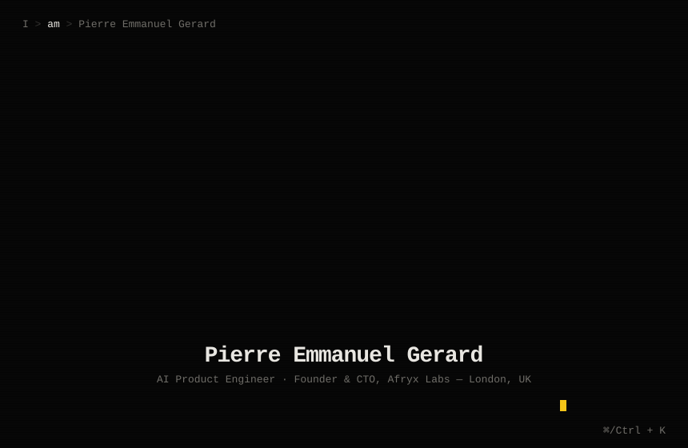
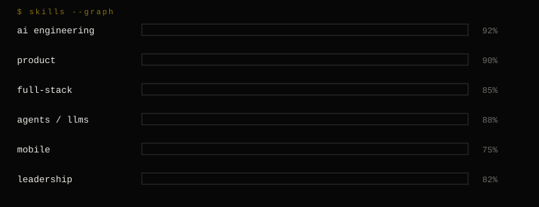
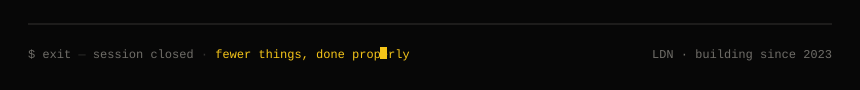

<div align="center">



</div>

<br/>

```console
pierre@ldn:~$ whoami
```

I work at the **applied layer of AI**: agent orchestration, tool use, memory, evaluation,
and the feedback loops that turn a model into a product. I take AI products from
first sketch to production and stay close to both the architecture and the user.

Founder & CTO of **[Afryx Labs](https://www.afryxlabs.com)**, an African technology company
building world-class software from the continent, for the continent. I build in public:
shipping, testing ideas, debugging failures, and sharing what I learn.

`>` Open to applied AI engineering roles & internships (UK) · [ankouanepierre@gmail.com](mailto:ankouanepierre@gmail.com)

<br/>

```console
pierre@ldn:~$ ls ~/building
```

| status | project | what it is | stack |
|---|---|---|---|
| `● IN PRODUCTION` | **[Kampus](https://www.kampusafryx.com)** | Complete institution management platform — admissions, academics, finance, communication, with an AI operations layer. Afryx Labs' flagship, live with fee-paying schools on a multi-tenant Postgres backend. | Next.js · Supabase · Expo · LangGraph |
| `● IN DEV` | **O'pep** | Interurban bus booking for Cameroon — search agencies, compare, pick your seat live, pay by Mobile Money. Two-sided: traveller app + free agency ticketing software. | Expo · React + Vite · Supabase |
| `● LIVE` | **[Arcflow](https://www.arcflowhq.com)** | AI Chief of Staff for growing teams. One wedge — action tracking & accountability — executed relentlessly. LangGraph multi-agent pipeline on a multi-tenant backend, shipped solo. | LangGraph · Supabase · Stripe |
| `● IN DEV` | **Miyora AI** | Skin intelligence — making an AI recommendation feel as considered as a professional consultation. | Claude API · React Native · CV |
| `● OPEN WORK` | **[pierre-agent-evals](https://github.com/ByEmG/pierre-agent-evals)** | Evaluation harness for LLM agents built around a six-category failure taxonomy: task suite, failure classification, pass rate / cost / latency reporting. Results published as they land. | Python · Anthropic API · pytest |

<br/>

```console
pierre@ldn:~$ skills --graph
```



<div align="center">

`Python` `TypeScript` `Machine Learning` `Agent Orchestration` `Agent Evaluation` `LangGraph` `Claude API` `Next.js` `Supabase / PostgreSQL` `React Native` `Product`

</div>

<br/>

```console
pierre@ldn:~$ history --career
```

```
2026   Founder & CTO         · Afryx Labs
2026   Founder & CEO         · Arcflow
2025   Asst. Tech Engineer   · Institut Supérieur Fang de Messamena
2025   Co-Founder            · Miyora Skin Lab
2023   Student Ambassador    · Oxford International Education Group
2021   Data Science Intern   · BCPME
```

```
2027   BSc Applied Artificial Intelligence · University of Bradford
 —     CMI Level 5 · Management & Leadership
```

<br/>

```console
pierre@ldn:~$ ping pierre
```

<div align="center">

<a href="mailto:ankouanepierre@gmail.com"></a>&nbsp;
<a href="https://pierreankouane.dev"></a>&nbsp;
<a href="https://www.linkedin.com/in/pierreemmanuelgerard"></a>&nbsp;
<a href="https://www.afryxlabs.com"></a>&nbsp;
<a href="https://www.arcflowhq.com"></a>

<br/><br/>


&nbsp;


</div>

<br/>

<div align="center">



</div>
